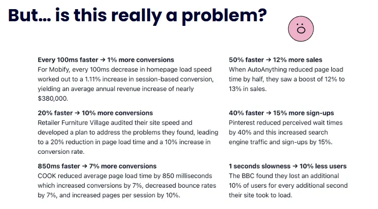
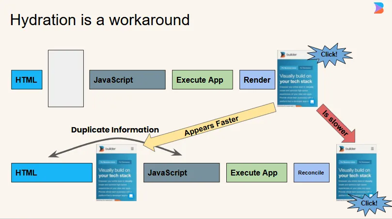
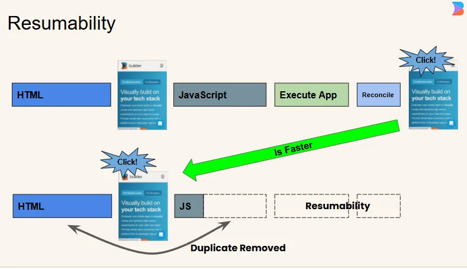

# Qwik: The Future of Web Performance

## Beyond Hydration to True Resumability

---

## What is Qwik?

Qwik is a **new kind of web framework** that delivers **instant loading** regardless of application size.

### Key Innovation:

- **Zero JavaScript by default** - No upfront bundle
- **O(1) loading** - Performance doesn't degrade as your app grows
- **Resumability** - No hydration required
- **Full-stack** - Client and server in one codebase

### Built by the Creator of Angular

Created by **Miško Hevery** (Angular's original architect) to solve the fundamental performance problems of modern web frameworks.

---

## 🎯 The Performance Crisis

### The Reality Check



**Every 100ms delay = 1% conversion loss**

- **53% of users** abandon sites that take >3s to load
- **Google ranks** fast sites higher in search results
- **Mobile users** are even less patient

### What's Causing This?

Current frameworks ship **too much JavaScript**, forcing users to wait while browsers:

- Download massive bundles
- Parse and compile code
- Re-execute everything that already ran on the server

---

## 🚨 The Hydration Problem

### The Core Difference:

**Traditional Frameworks (Hydration):**

- Server sends HTML skeleton 💀
- Client downloads ALL JavaScript 📦📦📦
- Client rebuilds everything from scratch 🔨
- Finally works after 3+ seconds ⏰

### The Hydration Tax:



- ❌ **Double execution** (server + client)
- ❌ **Large bundle downloads** (entire app upfront)
- ❌ **Blocking JavaScript** (nothing works until loaded)
- ❌ **Wasted CPU cycles** (re-doing server work)



**Qwik's Solution: Resumability**

Instead of re-executing code, Qwik **resumes** where the server left off - making it the **first O(1) JavaScript framework**.

---

## 🎂 The Cake Analogy

### Traditional Frameworks (Hydration):

1. 👨‍🍳 Server bakes a delicious cake
2. 📸 Server takes a photo of the cake
3. 📋 Server writes down the recipe
4. 📦 Server ships photo + recipe to client
5. 🛒 **Client goes shopping for ingredients**
6. 👩‍🍳 **Client bakes the entire cake again**
7. 🍰 User finally eats the cake

### Qwik (Resumability):

1. 👨‍🍳 Server bakes a delicious cake
2. 🚚 **Server ships the actual cake**
3. 🍰 User eats immediately

**No duplicate work. No waiting. Just results.**


---

## 💡 The Magic of the `$` Symbol

The `$` is Qwik's **superpower** - it creates **lazy boundaries** that make resumability possible.

### What `$` Actually Does:

1. **Creates separate chunks** - Each `$` becomes its own JavaScript file
2. **Enables lazy loading** - Code only downloads when actually needed
3. **Preserves context** - Variables are automatically serialized
4. **Works everywhere** - Client, server, or anywhere in between

### React vs Qwik: The Key Difference

**React (Eager Loading):**

```javascript
function MyComponent() {
  // ALL of this runs immediately when component mounts
  const expensiveData = fetchHeavyData();
  const handleSubmit = async (data) => {
    await saveToDatabase(data);
  };

  return (
    <form onSubmit={handleSubmit}>
      <button>Submit</button>
    </form>
  );
}
// Bundle size: Everything included upfront
```

**Qwik (Function-Level Lazy Loading):**

```typescript
// 🚫 NEVER BUNDLED: Build-time only code
const BUILD_TIMESTAMP = Date.now(); // Inlined as static value
const heavyBuildTimeData = processLargeDataset(); // Computed at build time

export const MyComponent = component$(() => {
  // ✅ BUNDLED: Basic component structure
  const userId = useSignal("123");

  // ❌ LAZY: Only loads when data is actually needed
  const expensiveData = useResource$(async () => {
    return await fetchHeavyData(); // → chunk-data.js (2KB)
  });

  // ❌ LAZY: Only loads when form is submitted
  const handleSubmit$ = $(async (data) => {
    return await saveToDatabase(data); // → chunk-submit.js (1KB)
  });

  // ❌ LAZY: Only loads when button is clicked
  const deleteUser$ = server$(async (userId: string) => {
    return await db.users.delete(userId); // → server-only (0KB client)
  });

  return (
    <div>
      {/* ✅ BUNDLED: Static HTML structure */}
      <form onSubmit$={handleSubmit$}>
        <button>Submit</button>
      </form>
      <button onClick$={() => deleteUser$(userId.value)}>Delete User</button>
    </div>
  );
});

// Initial bundle: ~200 bytes (just the HTML + basic state)
// React equivalent: 15KB+ (entire component + dependencies)
```

### **Key Difference: Function-Level vs Component-Level**

**React:** Lazy loads **entire components**

```javascript
// ALL or NOTHING - entire component must load
const HeavyComponent = lazy(() => import("./HeavyComponent"));
// 15KB chunk includes: component + all its functions + dependencies
```

**Qwik:** Lazy loads **individual functions**

```typescript
// GRANULAR - each function is its own chunk
const lightFunction$ = $(() => doSimpleThing()); // → 100 bytes
const heavyFunction$ = $(() => doComplexThing()); // → 5KB
// Only loads the exact function you actually use
```

### Server Functions with `server$`:

```typescript
export const UserProfile = component$(() => {
  const userId = useSignal("123");

  return (
    <button
      onClick$={() =>
        server$(async () => {
          // This runs on the SERVER, not client!
          const user = await db.users.findById(userId.value);
          const secrets = await getApiKeys(); // Stays on server!

          return {
            name: user.name,
            email: user.email,
          };
        })()
      }
    >
      Load Profile
    </button>
  );
});
```

**Key Benefits:**

- 🔒 **Server code stays on server** (security)
- 📦 **Zero client bundle impact**
- ⚡ **Direct database/API access**
- 🎯 **Type-safe** end-to-end

---

## 📊 Performance Metrics That Matter

### Traditional Frameworks:

| Metric                  | React  | Vue    | Angular |
| ----------------------- | ------ | ------ | ------- |
| **Initial JS**          | 42KB+  | 38KB+  | 50KB+   |
| **Time to Interactive** | 1.2s+  | 1.1s+  | 1.5s+   |
| **Bundle Growth**       | Linear | Linear | Linear  |

### Qwik:

| Metric                  | Qwik        |
| ----------------------- | ----------- |
| **Initial JS**          | ~1KB        |
| **Time to Interactive** | **Instant** |
| **Bundle Growth**       | **O(1)**    |

### Results:

- ✅ **100/100 Lighthouse** scores out of the box
- ✅ **Perfect Core Web Vitals** on any device
- 📈 **Higher conversion rates** (faster = more sales)
- 💰 **Lower hosting costs** (less compute needed)

---

## 🎯 The Bottom Line

> "While others try to make hydration faster, Qwik makes it unnecessary."

### Key Benefits:

- **O(1) loading** regardless of app size
- **Zero configuration** performance
- **Full-stack development** with `server$`
- **Future-proof** architecture

---

## 🚀 Get Started

```bash
npm create qwik@latest my-app
```

**Resources:** [qwik.new](https://qwik.new) • [Docs](https://qwik.builder.io/docs) • [Discord](https://qwik.builder.io/chat)

---

## ❓ Questions & Discussion

**Let's talk about:**

- 🤔 Your current performance challenges
- 🚀 How Qwik could help your projects
- 🛠️ Migration strategies from existing frameworks
- 🔮 The future of web development

**Thank you!**

_The future is resumable. The future is Qwik._ ⚡

---

### Appendix: Technical Deep Dive

<details>
<summary>Click to expand technical details</summary>

#### How Serialization Works:

```typescript
// Qwik automatically serializes application state
const appState = {
  user: { id: 123, name: "John" },
  cart: [{ id: 1, quantity: 2 }],
  ui: { modalOpen: false },
};

// Becomes this in HTML:
// <script type="qwik/json">{"user":{"id":123,"name":"John"},...}</script>
```

#### Lazy Loading Mechanism:

```typescript
// Each $ creates a lazy boundary
const lazyFunction$ = $(() => {
  // This code is split into its own chunk
  // Loaded only when the function is called
  return expensiveComputation();
});

// Generates: chunk-abc123.js with just this function
```

#### Component Resumability:

```typescript
// Server renders with serialized state
<div q:component="MyComponent" q:props='{"count":5}'>
  <button q:listener="click:./chunk-def456.js#increment">Count: 5</button>
</div>

// Client resumes without re-execution
// When button clicked, only chunk-def456.js loads
```

</details>
