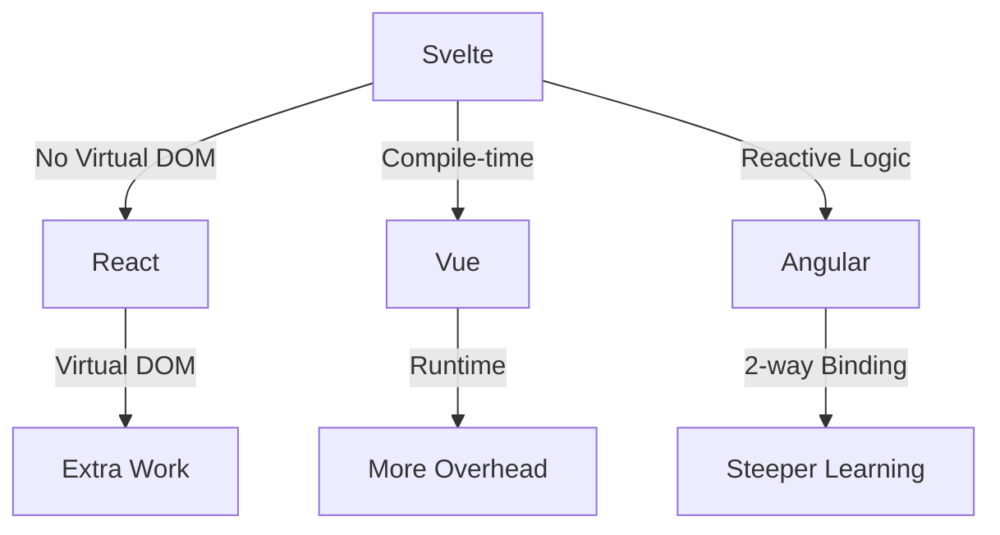

# 🚀 SvelteJS – Let’s Dive In

- With your host: **Ramy Hadid**
- A full-stack developer
- (Svelte & GO / Node & NextJS)

---

## 🌱 What _is_ SvelteJS?

- It’s a JavaScript framework — but not like the others.
- No virtual DOM (yep, it skips that drama).
- Super reactive by design.
- You write less code, and it does more for you.
- It compiles your code before it even hits the browser.
- Easy to pick up — even if you're not a JS pro.

---

## ✨ Why You Might Like It

- Variables update the UI _instantly_ — just by changing them.
- Animations? Built-in.
- Styling? Scoped and tidy.
- No crazy setup or boilerplate.
- Stores help you handle app-wide state.
- Lightweight and super fast.

---

## ⚔️ Svelte vs The Others



- Basically: Svelte cuts out a lot of middle steps.
- It’s like doing things _directly_, not through layers of magic.

---

## 🛠️ Getting Started

- Install Node.js if you haven’t already.
- Clone the template:  
  `npx sv create my-app`

  ```sh
  ramy@macintosh:~ cd my-app
  ramy@macintosh:~ npm install
  ```

- Start dev server: `npm run dev`
- Open in browser. Edit stuff. Watch it change live.  
  💡 Try messing with `+page.svelte` and save — magic.

---

## 📦 A Simple Component

```svelte
<script>
  let name = 'Besties';
</script>

<h1>Hello {name} 👋</h1>

<style>
  h1 {
    color: hotpink;
  }
</style>

```

- That’s _literally_ it.
- Logic. Markup. Style — all in one file.
- No drama.

---

## 🔁 Reactive Declarations

```js
let count = 1;
$: double = count * 2;
```

- Just slap `$:` before a line and boom — reactivity.
- You don’t have to call `setState()` or any of that stuff.
- Clean, right?

---

## 📦 Stores

```js
import { writable } from "svelte/store";

const score = writable(0);
```

- Think of stores like shared variables.
- Everyone can read/write/react to them.
- Use them when you need global-ish state (like user info, themes, etc.).

---

## 💃 Built-in Transitions

```svelte
<div transition:fade>Heyyy</div>

```

- Wanna animate something? Just add `transition:whatever`.
- No installing anything. It’s just... there.
- Try `fly`, `fade`, `scale`, `slide`.

---

## 🎨 Styling Things

```svelte
<style>
  p {
    color: purple;
  }
</style>

```

- Every component gets its own styles.
- No weird global CSS conflicts.
- Wanna use SCSS or Less? You can!

---

## 🌍 Svelte World

- **SvelteKit**: Next-level stuff — routing, SSR, full-stack vibes.
- **Lots of community goodies**: Libraries, tools, Discords.
- Super welcoming — tons of people sharing cool projects.

---

## ✅ TL;DR

- Svelte is chill but powerful.
- You write less, and it does more.
- Fast, clean, and fun.
- If React is a microwave, Svelte is just lighting a fire and cooking real food 🔥

---

## 🎉 Let’s Build Stuff

Let’s mess around with it and see what we can break (and fix 😄).  
No pressure, just vibes.  
We’ll learn as we go.

# EXAMPLES ---

```svelte
<script>
	let count = 0;
</script>

<button on:click={() => count++}>
	Count: {count}
</button>
```

🔹 on:click binds a click event
🔹 {count} displays the reactive variable

✅ 2. Two-Way Binding (Input)

```svelte
<script>
	let name = '';
</script>

<input bind:value={name} placeholder="Type your name" />
<p>Hello, {name}!</p>
```

🔹 bind:value automatically keeps name in sync with input

✅ 3. If Condition

```svelte
<script>
	let isLoggedIn = false;
</script>

<button on:click={() => isLoggedIn = !isLoggedIn}>
	Toggle Login
</button>

{#if isLoggedIn}
	<p>Welcome back!</p>
{:else}
	<p>Please log in.</p>
{/if}
```

🔹 {#if ...}{:else}{/if} is Svelte’s conditional block syntax

✅ 4. Each Loop

```svelte
<script>
	let items = ['🍎 Apple', '🍌 Banana', '🍇 Grape'];
</script>

<ul>
	{#each items as item}
		<li>{item}</li>
	{/each}
</ul>
```

🔹 {#each} is used for looping through arrays

✅ 5. Reactive Statement

```svelte
<script>
	let a = 2;
	let b = 3;
	$: sum = a + b; // reactive statement
</script>

<input type="number" bind:value={a} />
+
<input type="number" bind:value={b} />
=
<strong>{sum}</strong>
```
