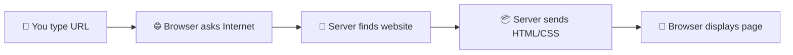

# 🌐 Build Your First Web Page with HTML & CSS

### *A Complete Beginner's Workshop Guide*

<div align="center">
  
</div>

---

## 🎯 Workshop Overview

Welcome to web development! This workshop is for **complete beginners** with zero coding experience. In 1.5-2 hours, you'll understand how websites work and build your first web page.

---

## 🌍 How the Web Works

When you visit a website like `www.google.com`:



1. 🔍 Your browser asks the internet: "Where is Google?"
2. 📦 Google's server sends back: HTML, CSS, and images
3. 🎨 Your browser displays the beautiful webpage

**This happens in under 2 seconds!** ⚡

---

## 🏗️ HTML + CSS: The Building Blocks

Every website uses these two languages:

| Language | Purpose | Like... |
|----------|---------|---------|
| **🏗️ HTML** | Structure & Content | The skeleton of a house |
| **🎨 CSS** | Styling & Design | The paint & decoration |

### HTML Example:
```html
<h1>This is a heading</h1>
<p>This is a paragraph.</p>

```

### CSS Example:
```css
h1 {
    color: blue;
    font-size: 2rem;
}
```

---

## 📋 Workshop Structure (1.5-2 Hours)

### 🕐 **Part 1: HTML Fundamentals** *(45 min)*
**[👉 Learn HTML](./html.md)**

### 🕑 **Part 2: CSS Styling** *(45 min)*
**[👉 Learn CSS](./css.md)**

### 🕒 **Part 3: Project Walkthrough** *(15-30 min)*
See the complete webpage in action

---

## 🎨 What We'll Build

A personal portfolio webpage with:
- ✨ Beautiful colors and fonts
- 📱 Works on phones and computers
- 📝 Contact form
- 🎯 Professional layout

---

## 🔧 What You Need

- **Visual Studio Code** (free text editor)
- **Chrome Browser**
- **Workshop Files** (in the `code/` folder)
- **No coding experience required!**

---

## 🚀 Ready to Start?

1. Open VS Code
2. Open the workshop files
3. Start with HTML basics
4. Add CSS styling
5. Celebrate your first webpage! 🎉

### 👉 **[Start Learning HTML →](./html.md)**

---

## 📚 Resources

- **[HTML Tutorial](./html.md)** - Learn structure
- **[CSS Tutorial](./css.md)** - Learn styling  
- **[Project Files](./code/)** - Ready-to-edit code

---

*Let's build something amazing!* ✨

### Skills Required
- **None!** We start from absolute zero
- Just bring curiosity and willingness to learn 🚀

---

## 💡 Key Concepts You'll Learn

### HTML Basics
- How to structure content with tags
- Creating headings, paragraphs, and lists
- Adding images and links
- Building forms for user input

### CSS Fundamentals
- Connecting styles to HTML
- Colors, fonts, and spacing
- Creating layouts with Flexbox
- Making responsive designs

---

## 🌟 Why Learn Web Development?

- 💰 **High-demand skill** - Excellent career opportunities
- 🌍 **Work from anywhere** - Remote-friendly field
- 🎨 **Creative + logical** - Perfect blend of art and science
- 🚀 **Build your ideas** - Turn concepts into reality

---

## 🛡️ Don't Worry If...

- **"I'm not technical"** → Web development is more creative than technical!
- **"I'm bad at math"** → HTML/CSS uses almost no math
- **"I might break something"** → Impossible! Experiment freely
- **"I'm too old/young"** → People learn coding successfully at any age

---

## 🚀 Ready to Start?

**Step 1:** Open VS Code and the workshop files
**Step 2:** Begin with HTML fundamentals
**Step 3:** Add beautiful CSS styling
**Step 4:** Celebrate your first webpage! 🎉

### 👉 **[Start with HTML Basics →](./html.md)**

---

## 📚 Workshop Resources

| Resource | Purpose |
|----------|---------|
| **[HTML Guide](./html.md)** | Complete HTML tutorial |
| **[CSS Guide](./css.md)** | Complete CSS tutorial |
| **[Code Files](./code/)** | Ready-to-edit project files |

---

*Let's build something amazing together!* ✨
- How to make your site accessible to everyone
- Creating forms that actually work

### 🎨 **CSS Styling**

```css
/* This is what CSS looks like */
h1 {
  color: #3498db;
  font-size: 2.5rem;
  text-align: center;
}

.beautiful-box {
  background: linear-gradient(45deg, #ff6b6b, #4ecdc4);
  padding: 20px;
  border-radius: 10px;
}
```

**You'll learn:**
- How to make text beautiful and readable
- Creating stunning color combinations
- Building responsive layouts that work everywhere
- Adding subtle animations and effects

---

## 🌟 Why This Matters: The Big Picture

### 🚀 **Career Opportunities**

Web development is one of the most in-demand skills globally:
- 💰 Average salary: $50,000 - $120,000+
- 🌍 Work from anywhere
- 💼 Freelance opportunities
- 🚀 Launch your own digital products

### 🎯 **Real-World Applications**

After today, you'll be able to create:
- Personal portfolio websites
- Small business websites
- Landing pages for projects
- Interactive forms and surveys
- Beautiful email templates

### 🧠 **Transferable Skills**

Learning web development teaches you:
- **Problem-solving** - Breaking complex problems into small pieces
- **Attention to detail** - Small mistakes can break everything
- **Creative thinking** - Turning ideas into visual reality
- **Logical thinking** - Understanding cause and effect

---

## 🛡️ Common Beginner Worries (And Why They're Okay!)

### 😰 *"I'm not technical enough"*
**Reality:** Web development is more creative than technical. If you can use a computer and have ideas, you can learn this!

### 😰 *"I'm too old to learn coding"*
**Reality:** People successfully learn coding at 16, 35, 55, and even 75! Age is just a number.

### 😰 *"I'm not good at math"*
**Reality:** Web development uses very little math. It's more about logic and creativity.

### 😰 *"I'll break something"*
**Reality:** It's impossible to break your computer with HTML and CSS. Experiment freely!

---

## 🎓 Learning Outcomes

By the end of this workshop, you will:

### ✅ **Understand:**
- How websites work behind the scenes
- The relationship between HTML, CSS, and browsers
- How to read and write basic HTML and CSS
- Industry best practices for clean code

### ✅ **Be Able To:**
- Create a complete web page from scratch
- Style text, images, and layouts professionally
- Make websites that look good on all devices
- Debug simple HTML and CSS issues
- Know where to find help and continue learning

### ✅ **Feel Confident To:**
- Experiment with code without fear
- Build your own projects
- Continue learning more advanced topics
- Help others who are just starting out

---

## 🌈 Let's Begin the Journey!

**Remember: Every line of code you write today is a step toward becoming the developer you want to be.**

Ready to dive in? Let's start with understanding HTML!

**👉 [Start with HTML Fundamentals →](./html.md)**

---

## 📚 Quick Reference

| Resource | Purpose | Link |
|----------|---------|------|
| 🏗️ **HTML Deep Dive** | Complete HTML tutorial | [html.md](./html.md) |
| 🎨 **CSS Mastery** | Complete CSS tutorial | [css.md](./css.md) |
| 💻 **Project Code** | Ready-to-use code files | [code/](./code/) |

---

*Made with ❤️ by [Adel HB](https://github.com/Adel2411) for aspiring developers. Let's build something amazing together!* ✨