# 🎨 CSS: Bringing Your Web Pages to Life

### *From Plain Text to Stunning Designs*

---

## 🎯 What You'll Master

By the end of this section, you'll know how to:
- Transform plain HTML into beautiful designs
- Control colors, fonts, spacing, and layouts
- Create responsive designs that work on all devices
- Use modern layout techniques like Flexbox
- Apply professional styling principles

---

## 🎨 Understanding CSS: Your Digital Paintbrush

### CSS is Like Interior Design

Just like decorating a house, CSS lets you:
- 🎨 **Choose colors** for walls (backgrounds) and furniture (text)
- 📏 **Arrange furniture** (layout and positioning)  
- 💡 **Control lighting** (shadows and effects)
- 🖼️ **Add decorations** (borders, animations, gradients)
- 📱 **Make it work for different rooms** (responsive design)

---

## 🔗 Chapter 1: Connecting CSS to HTML

### Three Ways to Add CSS

#### 1. **Inline Styles** (Quick & Dirty)
```html
<p style="color: red; font-size: 20px;">This text is red and large</p>
```
**When to use:** Quick tests, one-off styling
**Downside:** Hard to maintain, not reusable

#### 2. **Internal Styles** (Page-Specific)
```html
<head>
    <style>
        p {
            color: blue;
            font-size: 18px;
        }
    </style>
</head>
```
**When to use:** Styles specific to one page
**Downside:** Can't share across multiple pages

#### 3. **External Stylesheets** (Best Practice ⭐)
```html
<!-- In your HTML file -->
<head>
    <link rel="stylesheet" href="styles.css">
</head>
```

```css
/* In your styles.css file */
p {
    color: green;
    font-size: 16px;
}
```
**When to use:** Almost always!
**Benefits:** Reusable, maintainable, organized

---

## 🎯 Chapter 2: CSS Selectors - Targeting Elements

### Basic Selectors


#### 1. **Element Selector** - Style all elements of a type
```css
/* All paragraphs will be blue */
p {
    color: blue;
}

/* All headings will be large and bold */
h1 {
    font-size: 2.5rem;
    font-weight: bold;
}
```

#### 2. **Class Selector** - Style elements with a specific class
```html
<!-- HTML -->
<p class="highlight">This paragraph is special</p>
<p>This is a normal paragraph</p>
<div class="highlight">This div is also special</div>
```

```css
/* CSS - Targets anything with class="highlight" */
.highlight {
    background-color: yellow;
    padding: 10px;
}
```

#### 3. **ID Selector** - Style one unique element
```html
<!-- HTML -->
<div id="header">This is the main header</div>
```

```css
/* CSS - Targets the element with id="header" */
#header {
    background-color: navy;
    color: white;
    text-align: center;
}
```

### Advanced Selectors

```css
/* Multiple elements */
h1, h2, h3 {
    color: #333;
    font-family: Arial, sans-serif;
}

/* Descendant selector - span inside a paragraph */
p span {
    font-weight: bold;
}

/* Child selector - direct children only */
ul > li {
    list-style-type: square;
}

/* Pseudo-selectors */
a:hover {
    color: red;
}

button:active {
    background-color: #ccc;
}

input:focus {
    border-color: blue;
}
```

---

## 📦 Chapter 3: The Box Model - Understanding Layout

### Every Element is a Box


```css
.box-example {
    /* Content area */
    width: 300px;
    height: 200px;
    
    /* Padding - space inside the box */
    padding: 20px;
    
    /* Border - the box outline */
    border: 2px solid #333;
    
    /* Margin - space outside the box */
    margin: 15px;
    
    /* Background color */
    background-color: lightblue;
}
```

### Box Model in Action

```html
<div class="box-demo">Content goes here</div>
```

```css
.box-demo {
    width: 200px;           /* Content width */
    height: 100px;          /* Content height */
    padding: 20px;          /* Space inside */
    border: 5px solid red;  /* Border around */
    margin: 10px;           /* Space outside */
    background: yellow;
}

/* Total width = 200 + 20 + 20 + 5 + 5 + 10 + 10 = 270px */
```

### Box-Sizing: A Better Way

```css
/* Traditional box model */
.old-way {
    width: 200px;
    padding: 20px;
    border: 5px solid black;
    /* Total width = 200 + 20 + 20 + 5 + 5 = 250px */
}

/* Modern box model */
.new-way {
    box-sizing: border-box;
    width: 200px;
    padding: 20px;
    border: 5px solid black;
    /* Total width = exactly 200px */
}

/* Apply to everything (recommended) */
* {
    box-sizing: border-box;
}
```

---

## 🌈 Chapter 4: Colors and Typography

### Working with Colors

#### Color Formats

```css
.color-examples {
    /* Named colors */
    color: red;
    background-color: lightblue;
    
    /* Hex colors */
    color: #ff0000;          /* Red */
    background: #3498db;     /* Blue */
    
    /* RGB colors */
    color: rgb(255, 0, 0);   /* Red */
    background: rgb(52, 152, 219); /* Blue */
    
    /* RGBA (with transparency) */
    background: rgba(52, 152, 219, 0.5); /* 50% transparent blue */
    
    /* HSL (Hue, Saturation, Lightness) */
    color: hsl(0, 100%, 50%);    /* Red */
    background: hsl(204, 70%, 53%); /* Blue */
}
```

#### Beautiful Color Combinations

```css
/* Professional blue theme */
.blue-theme {
    --primary: #3498db;
    --secondary: #2c3e50;
    --accent: #e74c3c;
    --light: #ecf0f1;
    --dark: #34495e;
}

/* Warm sunset theme */
.sunset-theme {
    --primary: #ff6b6b;
    --secondary: #feca57;
    --accent: #48dbfb;
    --light: #f8f9fa;
    --dark: #2f3542;
}
```

### Typography: Making Text Beautiful

#### Font Fundamentals

```css
.typography-examples {
    /* Font family (with fallbacks) */
    font-family: 'Roboto', Arial, sans-serif;
    
    /* Font size */
    font-size: 18px;        /* Pixels */
    font-size: 1.2rem;      /* Relative to root */
    font-size: 120%;        /* Relative to parent */
    
    /* Font weight */
    font-weight: normal;    /* 400 */
    font-weight: bold;      /* 700 */
    font-weight: 300;       /* Light */
    
    /* Font style */
    font-style: normal;
    font-style: italic;
    
    /* Text alignment */
    text-align: left;
    text-align: center;
    text-align: right;
    text-align: justify;
    
    /* Line height (spacing between lines) */
    line-height: 1.5;       /* 1.5 times font size */
    
    /* Letter spacing */
    letter-spacing: 1px;
    
    /* Text decoration */
    text-decoration: none;      /* Remove underlines */
    text-decoration: underline;
}
```

#### Professional Typography Scale

```css
/* Establish a type scale */
h1 { font-size: 2.5rem; font-weight: 700; line-height: 1.2; }
h2 { font-size: 2rem;   font-weight: 600; line-height: 1.3; }
h3 { font-size: 1.5rem; font-weight: 600; line-height: 1.4; }
h4 { font-size: 1.25rem; font-weight: 500; line-height: 1.4; }
p  { font-size: 1rem;   font-weight: 400; line-height: 1.6; }

/* Consistent spacing */
h1, h2, h3, h4 { margin-bottom: 0.5rem; }
p { margin-bottom: 1rem; }
```

#### Google Fonts Integration

```html
<!-- In your HTML head -->
<link href="https://fonts.googleapis.com/css2?family=Inter:wght@300;400;500;600;700&display=swap" rel="stylesheet">
```

```css
/* In your CSS */
body {
    font-family: 'Inter', -apple-system, BlinkMacSystemFont, sans-serif;
}
```

---

## 📐 Chapter 5: Modern Layout with Flexbox

### Understanding Flexbox

```mermaid
graph LR
    A[Flex Container] --> B[Flex Item 1]
    A --> C[Flex Item 2]
    A --> D[Flex Item 3]
    A --> E[Main Axis ↔]
    A --> F[Cross Axis ↕]
```



Flexbox makes it easy to:
- Center content horizontally and vertically
- Create equal-height columns
- Distribute space evenly
- Reorder elements without changing HTML

### Basic Flexbox Setup

```css
.flex-container {
    display: flex;
    
    /* Main axis alignment (horizontal by default) */
    justify-content: center;    /* center, flex-start, flex-end, space-between, space-around */
    
    /* Cross axis alignment (vertical by default) */
    align-items: center;        /* center, flex-start, flex-end, stretch */
    
    /* Wrap items to new lines */
    flex-wrap: wrap;            /* wrap, nowrap, wrap-reverse */
    
    /* Gap between items */
    gap: 20px;
}

.flex-item {
    flex: 1;  /* Grow to fill available space */
}
```

### Practical Flexbox Examples

#### 1. **Perfect Centering**
```css
.center-everything {
    display: flex;
    justify-content: center;
    align-items: center;
    height: 100vh;  /* Full viewport height */
}
```

```html
<div class="center-everything">
    <div>I'm perfectly centered!</div>
</div>
```

#### 2. **Navigation Bar**
```css
.navbar {
    display: flex;
    justify-content: space-between;
    align-items: center;
    padding: 1rem 2rem;
    background: #333;
}

.nav-links {
    display: flex;
    gap: 2rem;
    list-style: none;
}
```

```html
<nav class="navbar">
    <div class="logo">My Site</div>
    <ul class="nav-links">
        <li><a href="#home">Home</a></li>
        <li><a href="#about">About</a></li>
        <li><a href="#contact">Contact</a></li>
    </ul>
</nav>
```

#### 3. **Card Layout**
```css
.card-container {
    display: flex;
    gap: 2rem;
    flex-wrap: wrap;
}

.card {
    flex: 1;
    min-width: 300px;
    padding: 2rem;
    background: white;
    border-radius: 8px;
    box-shadow: 0 2px 10px rgba(0,0,0,0.1);
}
```

---

## 📱 Chapter 6: Responsive Design

### Mobile-First Approach

```css
/* Base styles (mobile) */
.container {
    padding: 1rem;
    font-size: 16px;
}

/* Tablet styles */
@media (min-width: 768px) {
    .container {
        padding: 2rem;
        font-size: 18px;
    }
}

/* Desktop styles */
@media (min-width: 1024px) {
    .container {
        max-width: 1200px;
        margin: 0 auto;
        padding: 3rem;
        font-size: 20px;
    }
}
```

### Common Breakpoints

```css
/* Phone */
@media (max-width: 767px) {
    .mobile-only { display: block; }
    .desktop-only { display: none; }
}

/* Tablet */
@media (min-width: 768px) and (max-width: 1023px) {
    .grid { grid-template-columns: repeat(2, 1fr); }
}

/* Desktop */
@media (min-width: 1024px) {
    .mobile-only { display: none; }
    .desktop-only { display: block; }
    .grid { grid-template-columns: repeat(3, 1fr); }
}
```

### Responsive Images

```css
img {
    max-width: 100%;
    height: auto;
}

/* Hero image that scales nicely */
.hero-image {
    width: 100%;
    height: 50vh;
    object-fit: cover;
    object-position: center;
}
```

---

## ✨ Chapter 7: Visual Effects and Enhancements

### Gradients

```css
/* Linear gradients */
.gradient-bg {
    background: linear-gradient(45deg, #ff6b6b, #4ecdc4);
    background: linear-gradient(to right, #667eea 0%, #764ba2 100%);
}

/* Radial gradients */
.radial-gradient {
    background: radial-gradient(circle, #ff6b6b, #4ecdc4);
}

/* Text gradients */
.gradient-text {
    background: linear-gradient(45deg, #ff6b6b, #4ecdc4);
    -webkit-background-clip: text;
    -webkit-text-fill-color: transparent;
    background-clip: text;
}
```

### Shadows and Depth

```css
/* Box shadows */
.card {
    box-shadow: 0 2px 10px rgba(0, 0, 0, 0.1);  /* Subtle */
    box-shadow: 0 4px 20px rgba(0, 0, 0, 0.15); /* Medium */
    box-shadow: 0 8px 30px rgba(0, 0, 0, 0.2);  /* Strong */
}

/* Text shadows */
.text-shadow {
    text-shadow: 2px 2px 4px rgba(0, 0, 0, 0.3);
}

/* Inset shadows */
.inset {
    box-shadow: inset 0 2px 4px rgba(0, 0, 0, 0.1);
}
```

### Borders and Rounded Corners

```css
.rounded-elements {
    /* Simple rounded corners */
    border-radius: 8px;
    
    /* Different corners */
    border-radius: 10px 0 10px 0;
    
    /* Pill shape */
    border-radius: 50px;
    
    /* Circle */
    border-radius: 50%;
    width: 100px;
    height: 100px;
}

/* Creative borders */
.fancy-border {
    border: 3px solid;
    border-image: linear-gradient(45deg, #ff6b6b, #4ecdc4) 1;
}
```

### Transitions and Hover Effects

```css
/* Smooth transitions */
.button {
    background: #3498db;
    color: white;
    padding: 12px 24px;
    border: none;
    border-radius: 6px;
    transition: all 0.3s ease;
}

.button:hover {
    background: #2980b9;
    transform: translateY(-2px);
    box-shadow: 0 4px 12px rgba(52, 152, 219, 0.3);
}

/* Card hover effects */
.card {
    transition: transform 0.3s ease, box-shadow 0.3s ease;
}

.card:hover {
    transform: translateY(-5px);
    box-shadow: 0 8px 25px rgba(0, 0, 0, 0.15);
}
```

---

## 🎯 Chapter 8: CSS Best Practices

### Organizing Your CSS

#### 1. **Logical Structure**
```css
/* ======================
   TABLE OF CONTENTS
   1. Reset/Base Styles
   2. Typography
   3. Layout
   4. Components
   5. Utilities
   6. Media Queries
   ====================== */

/* 1. RESET/BASE STYLES */
* {
    box-sizing: border-box;
}

body {
    margin: 0;
    font-family: 'Inter', sans-serif;
    line-height: 1.6;
}

/* 2. TYPOGRAPHY */
h1, h2, h3, h4, h5, h6 {
    margin-top: 0;
    margin-bottom: 0.5rem;
}

/* 3. LAYOUT */
.container {
    max-width: 1200px;
    margin: 0 auto;
    padding: 0 1rem;
}

/* 4. COMPONENTS */
.button {
    /* Button styles */
}

.card {
    /* Card styles */
}

/* 5. UTILITIES */
.text-center { text-align: center; }
.margin-bottom { margin-bottom: 1rem; }

/* 6. MEDIA QUERIES */
@media (min-width: 768px) {
    /* Tablet styles */
}
```

#### 2. **CSS Custom Properties (Variables)**
```css
:root {
    /* Colors */
    --primary-color: #3498db;
    --secondary-color: #2c3e50;
    --success-color: #27ae60;
    --warning-color: #f39c12;
    --error-color: #e74c3c;
    
    /* Typography */
    --font-family: 'Inter', -apple-system, BlinkMacSystemFont, sans-serif;
    --font-size-base: 1rem;
    --line-height-base: 1.6;
    
    /* Spacing */
    --spacing-xs: 0.25rem;
    --spacing-sm: 0.5rem;
    --spacing-md: 1rem;
    --spacing-lg: 1.5rem;
    --spacing-xl: 2rem;
    
    /* Borders */
    --border-radius: 6px;
    --border-width: 1px;
}

/* Using variables */
.button {
    background: var(--primary-color);
    padding: var(--spacing-sm) var(--spacing-md);
    border-radius: var(--border-radius);
    font-family: var(--font-family);
}
```

---

## 🎉 You're Now a CSS Artist!

Congratulations! You've learned:
- ✅ How to connect CSS to HTML
- ✅ CSS selectors and the box model
- ✅ Colors, typography, and visual design
- ✅ Modern layout with Flexbox
- ✅ Responsive design principles
- ✅ Visual effects and animations
- ✅ Professional CSS organization

**🚀 Ready to see it all come together? Let's explore our complete project!**

**👉 [Back to Main Workshop →](./README.md)**

---

## 🔖 CSS Quick Reference

### Essential Properties

| Property | Purpose | Example |
|----------|---------|---------|
| `color` | Text color | `color: #333;` |
| `background` | Background color/image | `background: #f8f9fa;` |
| `font-size` | Text size | `font-size: 1.2rem;` |
| `padding` | Inside spacing | `padding: 1rem;` |
| `margin` | Outside spacing | `margin: 0 auto;` |
| `border` | Element border | `border: 1px solid #ccc;` |
| `display` | Layout method | `display: flex;` |
| `position` | Positioning | `position: relative;` |

### Common Values

| Unit | Description | Example |
|------|-------------|---------|
| `px` | Pixels (fixed) | `font-size: 16px;` |
| `rem` | Relative to root | `padding: 1rem;` |
| `%` | Percentage of parent | `width: 50%;` |
| `vh/vw` | Viewport height/width | `height: 100vh;` |

---

*Keep experimenting, keep creating, and remember: great design is an iterative process!* 🎨