# 🏗️ HTML: The Foundation of the Web

### *Building Beautiful Structures with Code*

---

## 🎯 What You'll Learn

By the end of this section, you'll understand:
- How HTML creates the skeleton of every webpage
- Essential HTML elements and when to use them
- How to structure content logically
- Creating interactive forms
- Writing semantic, accessible HTML

---

## 🏠 Understanding HTML: Your Digital Architecture

### Think of HTML Like Building a House

```mermaid
graph TD
    A[🏠 HTML Document] --> B[🚪 Head - Information]
    A --> C[🏠 Body - Content]
    C --> D[🔳 Header]
    C --> E[🔳 Main Content]
    C --> F[🔳 Footer]
    E --> G[📝 Sections]
    E --> H[📄 Articles]
```



| House Part | HTML Equivalent | Purpose |
|------------|-----------------|---------|
| 🏠 **Foundation** | `<html>` | The base that holds everything |
| 🚪 **Front Door** | `<head>` | Information visitors need to know |
| 🏠 **Rooms** | `<div>`, `<section>` | Different areas for different purposes |
| 🪟 **Windows** | `` | Views to the outside world |
| 🚪 **Interior Doors** | `<a>` | Connections between rooms |

---

## 📝 Chapter 1: HTML Document Structure

### The Basic HTML Template

Every HTML document follows this pattern:

```html
<!DOCTYPE html>
<html lang="en">
<head>
    <!-- Information ABOUT the page -->
    <meta charset="UTF-8">
    <meta name="viewport" content="width=device-width, initial-scale=1.0">
    <title>My Amazing Website</title>
    <link rel="stylesheet" href="styles.css">
</head>
<body>
    <!-- The actual content people see -->
    <h1>Welcome to My Website!</h1>
    <p>This is where your content goes.</p>
</body>
</html>
```

### Breaking Down Each Part


#### 1. **Document Declaration** (`<!DOCTYPE html>`)
```html
<!DOCTYPE html>
```
- Tells the browser: "This is modern HTML5!"
- Always goes at the very top
- **Think of it as:** Showing your ID at the door

#### 2. **The HTML Container** (`<html>`)
```html
<html lang="en">
    <!-- Everything else goes inside here -->
</html>
```
- Wraps your entire page
- `lang="en"` helps screen readers and search engines
- **Think of it as:** The walls of your house

#### 3. **The Head Section** (`<head>`)
```html
<head>
    <meta charset="UTF-8">
    <meta name="viewport" content="width=device-width, initial-scale=1.0">
    <title>What appears in the browser tab</title>
    <link rel="stylesheet" href="styles.css">
</head>
```
- Information **about** your page (not visible content)
- Links to CSS files, sets the page title
- **Think of it as:** The blueprint and wiring plans

#### 4. **The Body Section** (`<body>`)
```html
<body>
    <h1>This content is visible to users</h1>
    <p>Everything users see goes here!</p>
</body>
```
- All the visible content of your webpage
- **Think of it as:** The furnished rooms people actually see

---

## 🔤 Chapter 2: Text Elements - Making Words Matter

### Headings: Creating Hierarchy

HTML gives us 6 levels of headings:

```html
<h1>Main Title - Use Only Once Per Page</h1>
<h2>Major Section Heading</h2>
<h3>Subsection Heading</h3>
<h4>Sub-subsection Heading</h4>
<h5>Rarely Used</h5>
<h6>Very Rarely Used</h6>
```

**🎯 Pro Tip:** Think of headings like a book outline:
- `<h1>` = Book Title
- `<h2>` = Chapter Title  
- `<h3>` = Section Title
- `<h4>` = Subsection Title

### Paragraphs and Text Formatting

```html
<!-- Regular paragraph -->
<p>This is a normal paragraph with some text.</p>

<!-- Text with emphasis -->
<p>This text has <strong>strong importance</strong> and <em>emphasis</em>.</p>

<!-- Line breaks -->
<p>First line<br>Second line on a new line</p>

<!-- Inline code -->
<p>To create a paragraph, use the <code>&lt;p&gt;</code> element.</p>

<!-- Quotes -->
<blockquote>
    "The best way to learn HTML is by doing it!"
    <cite>- Every Web Developer Ever</cite>
</blockquote>
```

---

## 📋 Chapter 3: Lists - Organizing Information

### Unordered Lists (Bullet Points)

```html
<h2>My Favorite Web Technologies</h2>
<ul>
    <li>HTML - For structure</li>
    <li>CSS - For styling</li>
    <li>JavaScript - For interactivity</li>
</ul>
```

### Ordered Lists (Numbered)

```html
<h2>Steps to Build a Website</h2>
<ol>
    <li>Plan your content</li>
    <li>Write the HTML</li>
    <li>Style with CSS</li>
    <li>Test in browsers</li>
    <li>Launch to the world!</li>
</ol>
```

### Nested Lists (Lists Inside Lists)

```html
<h2>Web Development Skills</h2>
<ul>
    <li>Frontend
        <ul>
            <li>HTML</li>
            <li>CSS</li>
            <li>JavaScript</li>
        </ul>
    </li>
    <li>Backend
        <ul>
            <li>Node.js</li>
            <li>Python</li>
            <li>Databases</li>
        </ul>
    </li>
</ul>
```

---

## 🔗 Chapter 4: Links - Connecting the Web

### Different Types of Links

```html
<!-- Link to another website -->
<a href="https://www.google.com">Visit Google</a>

<!-- Link to another page on your site -->
<a href="about.html">About Us</a>

<!-- Link to an email address -->
<a href="mailto:hello@mysite.com">Send us an email</a>

<!-- Link to a phone number -->
<a href="tel:+1234567890">Call us: (123) 456-7890</a>

<!-- Link to a section on the same page -->
<a href="#contact-section">Jump to Contact</a>

<!-- Link that opens in a new tab -->
<a href="https://www.example.com" target="_blank">Open in New Tab</a>
```

### Making Images Clickable

```html
<a href="https://www.example.com">
    
</a>
```

---

## 🖼️ Chapter 5: Images - Adding Visual Appeal

### Basic Image Syntax

```html

```

**🔍 Breaking it down:**
- `src` = Source (where is the image?)
- `alt` = Alternative text (what if the image doesn't load?)

### Different Image Sources

```html
<!-- Local image in same folder -->


<!-- Image in subfolder -->


<!-- Image from the internet -->

```

### Responsive Images

```html
<!-- Image that scales with container -->

```

---

## 📦 Chapter 6: Containers - Organizing Content

### Div: The Swiss Army Knife

```html
<div class="hero-section">
    <h1>Welcome to My Site</h1>
    <p>This is a hero section wrapped in a div</p>
</div>

<div class="content-box">
    <h2>About Me</h2>
    <p>Some information about myself...</p>
</div>
```

### Span: For Inline Content

```html
<p>This paragraph has <span style="color: red;">red text</span> in the middle.</p>
```

**💡 Key Difference:**
- `<div>` = Block element (takes full width, new line)
- `<span>` = Inline element (only takes needed space)

---

## 🏛️ Chapter 7: Semantic HTML - Code That Makes Sense

### Why Semantic HTML Matters

**Benefits:**
- 🔍 **Better SEO** - Search engines understand your content
- ♿ **Accessibility** - Screen readers work better
- 🧹 **Cleaner Code** - Easier to maintain and update

### Semantic Layout Elements

```html
<!DOCTYPE html>
<html lang="en">
<head>
    <title>Semantic HTML Example</title>
</head>
<body>
    
    <!-- Site header with navigation -->
    <header>
        <nav>
            <ul>
                <li><a href="#home">Home</a></li>
                <li><a href="#about">About</a></li>
                <li><a href="#contact">Contact</a></li>
            </ul>
        </nav>
    </header>

    <!-- Main content area -->
    <main>
        <!-- Individual sections -->
        <section id="hero">
            <h1>Welcome to My Website</h1>
            <p>This is the main hero section</p>
        </section>

        <section id="about">
            <h2>About Me</h2>
            <article>
                <h3>My Story</h3>
                <p>Here's my background...</p>
            </article>
        </section>

        <!-- Sidebar content -->
        <aside>
            <h3>Recent Posts</h3>
            <ul>
                <li><a href="#">Post 1</a></li>
                <li><a href="#">Post 2</a></li>
            </ul>
        </aside>
    </main>

    <!-- Site footer -->
    <footer>
        <p>&copy; 2024 My Website. All rights reserved.</p>
    </footer>

</body>
</html>
```

### Semantic Elements Reference

| Element | Purpose | Example Use |
|---------|---------|-------------|
| `<header>` | Page/section header | Site logo, main navigation |
| `<nav>` | Navigation links | Menu, breadcrumbs |
| `<main>` | Primary content | Main page content |
| `<section>` | Thematic content group | About section, services |
| `<article>` | Standalone content | Blog post, news article |
| `<aside>` | Secondary content | Sidebar, related links |
| `<footer>` | Page/section footer | Copyright, contact info |

---

## 📝 Chapter 8: Forms - Getting User Input

### Basic Form Structure

```html
<form action="/submit" method="POST">
    
    <!-- Text input -->
    <label for="name">Your Name:</label>
    <input type="text" id="name" name="name" required>

    <!-- Email input -->
    <label for="email">Email Address:</label>
    <input type="email" id="email" name="email" required>

    <!-- Textarea for longer text -->
    <label for="message">Your Message:</label>
    <textarea id="message" name="message" rows="4" cols="50"></textarea>

    <!-- Submit button -->
    <button type="submit">Send Message</button>

</form>
```

### Different Input Types

```html
<!-- Various input types -->
<input type="text" placeholder="Enter text">
<input type="email" placeholder="your@email.com">
<input type="password" placeholder="Password">
<input type="number" min="1" max="100">
<input type="date">
<input type="tel" placeholder="Phone number">
<input type="url" placeholder="https://yoursite.com">

<!-- Checkboxes -->
<input type="checkbox" id="newsletter" name="newsletter">
<label for="newsletter">Subscribe to newsletter</label>

<!-- Radio buttons -->
<input type="radio" id="beginner" name="level" value="beginner">
<label for="beginner">Beginner</label>

<input type="radio" id="intermediate" name="level" value="intermediate">
<label for="intermediate">Intermediate</label>

<!-- Dropdown select -->
<select name="country">
    <option value="us">United States</option>
    <option value="uk">United Kingdom</option>
    <option value="ca">Canada</option>
</select>
```

---

## ✅ Chapter 9: HTML Best Practices

### Writing Clean, Maintainable HTML

#### 1. **Proper Indentation**

```html
<!-- ❌ Hard to read -->
<div><h1>Title</h1><p>Content</p><div><span>More content</span></div></div>

<!-- ✅ Easy to read -->
<div>
    <h1>Title</h1>
    <p>Content</p>
    <div>
        <span>More content</span>
    </div>
</div>
```

#### 2. **Meaningful Names**

```html
<!-- ❌ Unclear purpose -->
<div class="box1">
<div class="red-thing">

<!-- ✅ Clear purpose -->
<div class="hero-section">
<div class="error-message">
```

#### 3. **Always Include Alt Text**

```html
<!-- ❌ Not accessible -->


<!-- ✅ Accessible -->

```

---

## 🚀 You're Ready for CSS!

Congratulations! You now understand:
- ✅ How HTML creates webpage structure
- ✅ Essential HTML elements and their purposes  
- ✅ How to create accessible, semantic HTML
- ✅ Form creation for user interaction
- ✅ Best practices for clean code

**🎨 Ready to make it beautiful? Let's dive into CSS!**

**👉 [Continue to CSS Styling →](./css.md)**

---

## 🔖 Quick Reference

### Most Common HTML Elements

| Element | Purpose | Example |
|---------|---------|---------|
| `<h1>-<h6>` | Headings | `<h1>Main Title</h1>` |
| `<p>` | Paragraph | `<p>Text content</p>` |
| `<a>` | Link | `<a href="url">Link</a>` |
| `` | Image | `` |
| `<div>` | Container | `<div>Content</div>` |
| `<ul><li>` | List | `<ul><li>Item</li></ul>` |
| `<form>` | Form | `<form>Form elements</form>` |
| `<input>` | Form input | `<input type="text">` |

---

*Keep practicing, keep building, and remember: every expert was once a beginner!* 🌟
